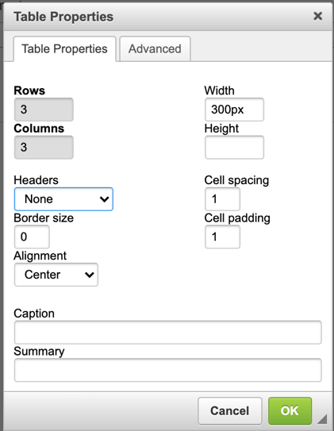

Virginia HigherEd Symptom Monitoring
====================================

Sponsored by the Council of Presidents for the public institutions in Virginia, a collaborative Tiger Team was formed to build a symptom tracking mechanism for use by all council institutions. The initiative was inspired by the symptom tracking survey George Mason University created in March 2020 at the onset of COVID-19 in Virginia. The collaborative effort was led by William & Mary.

## Table of Contents

[Design and Support Resources](#design-and-support-resources), with link to access GitHub repository

[Compiled Legal Advice](#compiled-legal-advice)

[COVID-19 14-Day Symptom and Exposure Screener](#covid-19-14-day-symptom-and-exposure-screener), by GMU

[COVID-19 Daily Health Check](#covid-19-daily-health-check)

[Docker Qualtrics Exporter](#link-to-access-github-repository-and-docker-qualtrics-exporter)

[Add-on: Integrating Qualtrics with Modo Labs, including Duo management](#add-on-integrating-qualtrics-with-modo-labs-including-duo-management)

[Add-on: Using APIs to save data in O365 One Drive](#add-on-using-apis-to-save-data-in-o365-one-drive)

[Add-on: Qualtrics messages instructions to facilitate red, yellow, green result messages](#add-on-qualtrics-graphics-instructions-to-add-images-to-result-messages)

[Add-on: Qualtrics graphics instructions to add images to result messages](#add-on-qualtrics-messages-instructions-to-facilitate-red-yellow-green-result-messages)

[Add-on: Qualtrics actions instructions to route replies by email](#add-on-qualtrics-actions-instructions-to-route-replies-by-email)

## Design and Support Resources

All files associated with this effort, including a copy of this document, can be found in GitHub.

[https://github.com/WMInfoTech/Virginia-HigherEd-Symptom-Tracking](https://github.com/WMInfoTech/Virginia-HigherEd-Symptom-Tracking)

This collaborative project was designed using platforms found in current institutional ecosystems, as identified through a technology landscape survey distributed to council Chief Information Officers. Landscape survey results indicated that participating institutions utilized Qualtrics and/or O365. The same two symptom evaluation mechanisms – the 14-day screen and a daily health check, were developed in Qualtrics and Microsoft Forms. This document describes components and how to access resources to support implementation at individual institutions. Functionality was assembled using common features within each platform. For questions on design of the tools or the custom Docker and Python work completed by William & Mary, please email symptomCOP@lists.wm.edu.

## Compiled Legal Advice

[compiledLegalAdvice.pdf](compiledLegalAdvice.pdf)

Information compiled by the Tiger Team from legal advisor. Advice references two documents externally generated documents, both included in the pdf.

1. Virginia Governor Northam's Higher Education Reopening Guidance, June 11, 2020
2. STUDENT PRIVACY POLICY OFFICE FERPA & Coronavirus Disease 2019 (COVID-19) Frequently Asked Questions (FAQs) March 2020

## COVID-19 14-Day Symptom and Exposure Screener

Questions authored and trademarked by George Mason University as COVID Health Check-ME™ and built as surveys by William & Mary for distribution through the Council of Presidents.

Description of tool: The goal of screening is to detect early disease or risk factors among large numbers of apparently health/asymptomatic individuals. Best practice is that individuals should complete a symptom screening prior to receiving authorization to access the workplace/facility. (description written GMU)

Files:

[Qualtrics QSF in GitHub](COVID-19_14-day_symptom_and_exposure_screener.qsf)

[Qualtrics MS Word export in GitHub](COVID-19_14-day_symptom_and_exposure_screener.docx)

MS Forms template export: [https://go.wm.edu/K5v5cl](https://go.wm.edu/K5v5cl)

For more information on importing and exporting O365 Forms, refer to the
[demo video in GitHub](msFormsTemplateExportImport.mp4) created by Microsoft for this project.

## COVID-19 Daily Health Check

Questions compiled by the COP Tiger Team and built as surveys by William & Mary for distribution through the Council of Presidents.

Description of tool: Intended to build community participation, in addition to identify risk factors, the daily tool asks about wellness measures to slow spread, critical symptoms, and common symptoms. Results are delivered with the same three tier scale as the 14-Day Screener: Red, Yellow, Green.

Files:

[Qualtrics QSF in GitHub](COVID-19_Daily_Self_Check.qsf)

[Qualtrics MS Word export in GitHub](COVID-19_Daily_Self_Check.docx)

MS Forms template export: https://go.wm.edu/n0zjP7

For more information on importing and exporting O365 Forms, refer to the
[demo video in GitHub](msFormsTemplateExportImport.mp4) created by Microsoft for this project.

### Link to access GitHub repository and Docker Qualtrics Exporter

This package contains scripts that will allow you to automate the export of Qualtrics survey data and deliver it to OneDrive. All the scripts contained in this project are simple and can run standalone if needed. This gives you the ability to fork and modify it in a way that is useful to you. The overall project is a representation of how it can be used.

We understand that every use case may differ. This should get you past the basics and move you right to the step where you process your survey results for subsequent action.

You can easily replace the OneDrive upload code with something else to send the data to a reporting tool, another data storage service, or read and act on the data in real-time. If you think your modification might be useful to others, please consider opening a pull request.

[https://github.com/WMInfoTech/continuous-qualtrics-exporter](https://github.com/WMInfoTech/continuous-qualtrics-exporter)

[https://hub.docker.com/r/wmit/continuous-qualtrics-exporter](https://hub.docker.com/r/wmit/continuous-qualtrics-exporter)

## Add-on: Integrating Qualtrics with Modo Labs, including Duo management

ModoLabs for Survey Delivery
 You can use the mobile view options in Modo to deliver access to the Survey through institution mobile applications. You should work with your Modo administrator to determine the best configuration option to deliver the best user experience.

ModoLabs with Communicate Premium and Personal Notifications
 Outlined in GitHub package. See ReadMe for technical information. With this option, the Modo Labs administrator should be consulted as there are configuration options and settings required. This assumes the institution has licensed "Communicate Premium" enabling push notifications to individuals through the Modo platform.

## Add-on: Using APIs to save data in O365 One Drive

Used to move data into O65 One Drive using Microsoft APIs. Outlined in GitHub package. See ReadMe for technical information.

## Add-on: Qualtrics graphics instructions to add images to result messages

The Qualtrics QSF export does not include objects from shared environments. External objects must be introduced into the environment and associated with the survey. Reference Qualtrics support for how to create an end of survey message.

Import the four images in the [image library](image_library/): red, yellow, green, spread.

## Add-on: Qualtrics messages instructions to facilitate red, yellow, green result messages

The Qualtrics QSF export does not include objects from shared environments. External objects must be introduced into the environment and associated with the survey. Reference Qualtrics support for how to create an end of survey message.

Create four end of survey messages: red, yellow, green, spread.

Edit Message

Insert table:

Populate table with appropriate imported image, sized 300x300. Add piped text for displaying current date/time, and add note with institutional messaging or instructions.

## Add-on: Qualtrics actions instructions to route replies by email

The Qualtrics QSF export does not include objects from shared environments. External objects must be introduced into the environment and associated with the survey. Reference Qualtrics support for how to create an end of survey message.

Create a new event-based Action on Survey response.

The condition is the question you want to notify on, when True.

The action is sending an email. Populate the email address and subject specific to the institution.

